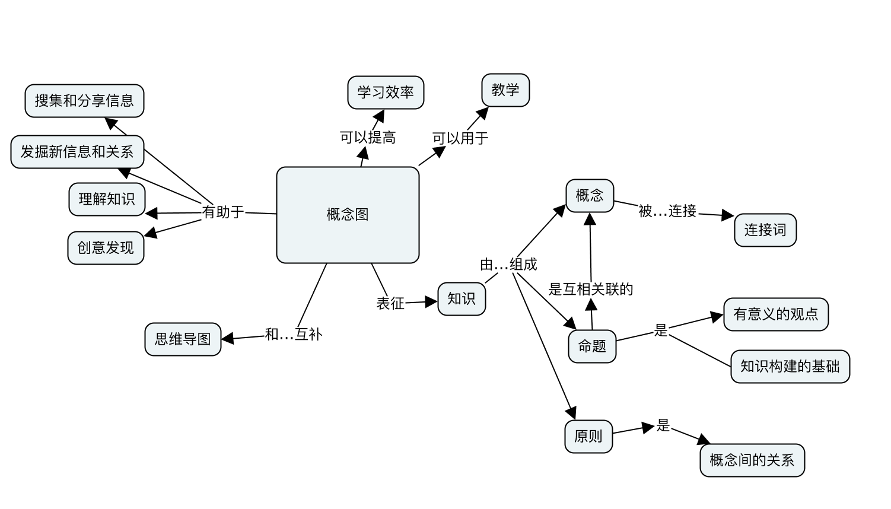

## 概念图
### 为什么需要概念图？
知识是由一个相互联系的概念通过关系构成的网络。学习是为了增加对这个网络的理解，从而更好地组织这个网络，乃至促进有基础，有意义的创造。
在学习新知识时，会接触到很多概念，学习者需要梳理清楚新概念和已知概念之间的关系，才能更好地理解知识。
在教学过程中，学员对知识的掌握程度如何，需要被可视化出来，这样教师才能发现学员可能理解不准确的地方。

### 什么是概念图？
我想邀请你通过一个概念图来了解概念图：


### 如何画概念图？
#### 步骤
1. 确定焦点问题
    该问题是你的概念图想要解决的问题或想要描述的知识领域。在焦点问题的指引下，识别并列出 10-20 个与焦点问题有关的概念。
2. 对概念进行排序
    把范围最广、最具包含性的概念置于概念图的顶端。有时候找出这样的概念并不容易，回头审视焦点问题对于决定概念的顺序很有帮助。
3. 重复第 2 步，依次排序列表中的概念
4. 开始构建概念图
    把最一般、最具包含性的概念放到概念图的顶端，顶端通常只有 1-3 个概念。
    可以用便利贴或[软件](http://cmap.ihmc.us/)来画概念图。
5. 选择子概念
    为每个概念选择 2-4 个子概念并放到其下。如果超过 4 个，可以找一个合适的中间概念，创建出另一个层次。
6. 用线条连接概念
7. 修订概念图的结构
8. 寻找概念图不同部分之间的交叉连接并标明连接词
9. 在概念图标签上可以附上概念的实例，比如狗是动物的实例
10. 同一组概念可以画出多种不同形式的概念图，当你对概念的理解变化的时候，概念图也要跟着变化

#### 实例
[实例](https://shimo.im/doc/0oWLdnziviUBS85Y)

## 参考资料
1. 优酷视频：[概念图的画法](http://v.youku.com/v_show/id_XMTc3NDgzMDU3Mg==.html?spm=a2h0k.8191407.0.0&from=s1.8-1-1.2)
1. 图书：[学习、创造和使用知识](https://book.douban.com/subject/26945842/)

## 答题流程
- 请用户仔细阅读题目要求和题目描述

- 在命令行中使用以下命令在用户本地任意目录下clone此题目库
```
git clone repo_of_this_template
```
NOTE：如果提示git命令未找到请先阅读参考资料
- 用任意编辑器打开clone下来的文件夹，内部会存在两个文件夹
```
spec  //测试文件夹
src   //源文件
```
`请在src文件下的person.js和student.js文件内实现`

- 完成函数后，使用以下命令设置github远程仓库地址 (my_url代表你自己的新的github地址)
```
 git remote set-url origin my_url
```
- 请使用**git提交(commit)**并**上传(push)**，之后将此github仓库地址(用户自建的) eg:（https://github.com/username/repo） 填入到提交地址一栏 
- 获取分支
- 提交
- 等待结果


## 如何本地运行

首先初次下载完需要安装依赖：

```
  npm install
```

然后才能执行测试：

```
  npm test
```

可以通过测试来检测本地代码是否完成作业要求，测试通过即可提交到github，把git库地址填到答题页面，并提交表单。
